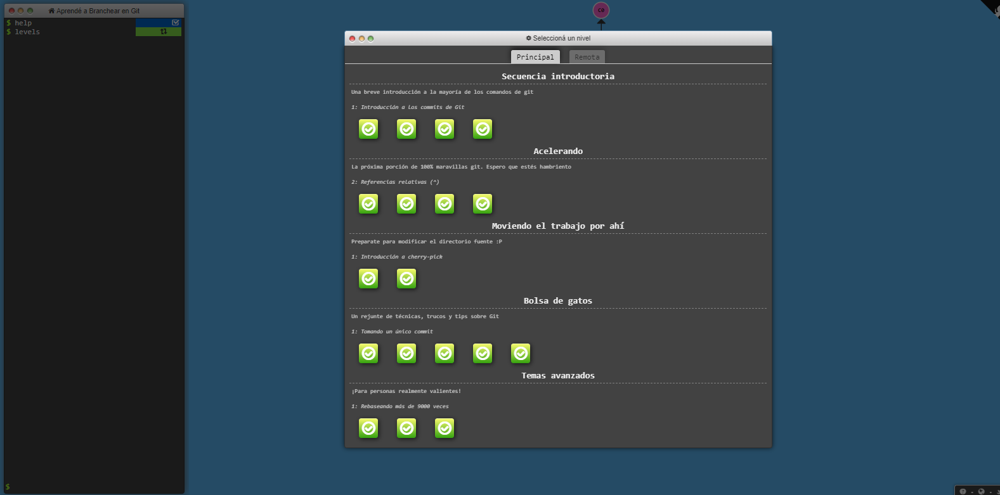

# Jose Manuel Nuñez reyes 2021-0233

## commit
    Crea un registro permanente de los cambios realizados en un archivo o conjunto de archivos en un repositorio Git.
## branch
    Crea una nueva rama (o línea de desarrollo) a partir de la rama actual.
## checkout
    Cambia la rama actual a otra rama existente o restaura archivos a un estado anterior.
## cherry-pick
    Aplica los cambios de un commit específico a la rama actual.
## reset
    Deshace los cambios en la rama actual a un estado anterior y puede eliminar commits.
## revert
    Deshace los cambios en la rama actual a un estado anterior creando un nuevo commit para hacerlo.
## rebase
    Aplica los cambios de una rama a otra rama modificando la historia del repositorio.
## merge
    Combina dos o más ramas creando un nuevo commit de combinación.

# Evidencia

